# Gym Management System

#### Azriel Ehrlich  
#### Itamar Haimov


## Table of Contents  
- [Phase 1: Design and Build the Database](#phase-1-design-and-build-the-database)  
  - [Introduction](#introduction)  
  - [ERD (Entity-Relationship Diagram)](#erd-entity-relationship-diagram)  
  - [DSD (Data Structure Diagram)](#dsd-data-structure-diagram)  
  - [SQL Scripts](#sql-scripts)  
  - [Data](#data)
  - [Backup](#backup)  
- [Phase 2: Advanced SQL and Data Manipulation](#phase-2-advanced-sql-and-data-manipulation)  
  - [Complex SQL Queries](#complex-sql-queries)  
  - [DELETE Operations](#delete-operations)  
  - [UPDATE Operations](#update-operations)  
  - [Constraints using ALTER TABLE](#constraints-using-alter-table)  
  - [Transaction Management - COMMIT and ROLLBACK](#transaction-management---commit-and-rollback)  
- [Phase 3: Integration and Views](#phase-3-integration-and-views)
  - [ERD Diagram - Received Department](#erd-diagram---received-department)
  - [DSD Diagram - Received Department](#dsd-diagram---received-department)
  - [ERD Diagram - Unified Database (Post-Integration)](#erd-diagram---unified-database-post-integration)
  - [DSD Diagram - After Integration](#dsd-diagram---after-integration)
  - [Integration Decisions and Explanations](#integration-decisions-and-explanations)
  - [Views and Queries](#views-and-queries)
    - [View 1 – `instructor_classes_view` (Instructor Classes View)](#view-1--instructor_classes_view-instructor-classes-view)
    - [View 2 – `cashier_orders_view` (Cashier Orders View)](#view-2--cashier_orders_view-cashier-orders-view)
- [Phase 4: Programming with PL/pgSQL](#phase-4-programming-with-plpgsql)  
  - [Function: `calc_weekly_hours`](#function-calc_weekly_hours)  
  - [Function: `get_cashier_orders`](#function-get_cashier_orders)  
  - [Procedure: `add_attendance`](#procedure-add_attendance)  
  - [Procedure: `update_hourly_rate`](#procedure-update_hourly_rate)  
  - [Trigger: `trg_default_checkout`](#trigger-trg_default_checkout)  
  - [Trigger: `trg_validate_cashier`](#trigger-trg_validate_cashier)  
  - [Main Block 1: Attendance Tracking](#main-block-1-attendance-tracking)  
  - [Main Block 2: Cashier Orders Report](#main-block-2-cashier-orders-report)  
  - [Summary](#summary)
- [Phase 5: Web Application Interface](#phase-5-web-application-interface)
  - [Overview](#overview)
  - [Features](#features)
  - [Technology Stack](#technology-stack)
  - [Database Integration](#database-integration)
  - [Application Instructions](#application-instructions)

## Phase 1: Design and Build the Database  

### Introduction

### Gym Management Database

The **Gym Management Database** is designed to efficiently manage information related to gym members, staff, and memberships. This system ensures smooth organization and tracking of essential details such as membership plans, staff assignments, member contact information, and fitness progress.

#### Purpose of the Database
This database serves as a structured and reliable solution for gyms to:  
- **Organize memberships** by type (e.g., monthly, annual) and status (active, expired).  
- **Manage staff assignments** by linking trainers and other staff to specific tasks or clients.  
- **Maintain member details**, including contact information, membership history, and fitness goals.  
- **Store contact information**, including addresses, phone numbers, and emails for members and staff.  
- **Track fitness progress**, such as training routines, goals, and attendance records.

#### Potential Use Cases
- **Gym Administrators** can use this database to efficiently manage membership plans, assign staff to clients, and store emergency contacts.  
- **Members** can track their membership status, view assigned trainers, and update personal fitness goals.  
- **Trainers and Staff** can view their assigned clients, schedule sessions, and monitor client progress.  
- **Management** can use the system for record-keeping, scheduling, and communication among all parties involved.  

This structured database helps streamline gym operations, improving organization, member satisfaction, and communication among all parties involved.

###  ERD (Entity-Relationship Diagram)    
  

###  DSD (Data Structure Diagram)   
  

###  SQL Scripts  
Provide the following SQL scripts:  
- **Create Tables Script** - The SQL script for creating the database tables is available in the repository:  

📜 **[View `create_tables.sql`](phase1/scripts/createTables.sql)**  

- **Insert Data Script** - The SQL script for insert data to the database tables is available in the repository:  

📜 **[View `insert_tables.sql`](phase1/scripts/insertTables.sql)**  
 
- **Drop Tables Script** - The SQL script for droping all tables is available in the repository:  

📜 **[View `drop_tables.sql`](phase1/scripts/dropTables.sql)**  

- **Select All Data Script**  - The SQL script for selectAll tables is available in the repository:  

📜 **[View `selectAll_tables.sql`](phase1/scripts/selectAll.sql)**  
  
###  Data  
####  First tool: using [mockaro](https://www.mockaroo.com/) to create csv file
#####  Entering data about members and classes they take
-  person id scope 1-400
- class id scope 1-750
  📜[View `class_membershipMock_data.csv`](Phase1/mockData/nannyMOCK_DATA.csv)
#####  Entering a data to instructors
-  instructor id scope 1-400


📜[View `instructorMock_data.csv`](phase1/mockarooFiles/instractors_data.csv)


####  Second tool: using [generatedata](https://generatedata.com/generator). to create csv file 
#####  Entering data about members of the gym
-  Group Number  scope 1-400 
📜[View `member_dataGenerateData.csv`](phase1/generatedataFiles/member_data.csv)


####  Third tool: using python to insert data to the database
#####  Creating and Entering data about classes in the gym
📜[View `classes.csv`](phase1/programming/classes.csv)

📜[View `generate_classes.py`](phase1/programming/generate_classes.py)

📜[View `insert_classes.py`](phase1/programming/insert_classes.py)

##### creating and entering data about payments
📜[View `payments.csv`](phase1/programming/payments.csv)

📜[View `generate_payments.py`](phase1/programming/generate_payments.py)

📜[View `insert_payments.py`](phase1/programming/insert_payments.py)


### Backup 
-   backups files are kept with the date and hour of the backup:  

[backup_directory](backups)


# Phase 2: Advanced SQL and Data Manipulation

This phase focuses on advanced SQL operations, including complex queries, data updates, deletions, constraints, and transaction control using ROLLBACK and COMMIT. These elements enhance the reliability, consistency, and functionality of our Gym Management System.

---

## Complex SQL Queries

Each query below includes:

* A description in English
* A screenshot of the query execution in SSMS
* A screenshot showing the result (only 5 rows maximum per screenshot)

### Query 1: List all Members with Their Membership Type

* **Description:** List all members with their membership type, including price and duration.

```sql
SELECT m.memberID, m.name, m.email, m.phone, ms.type AS membership_type, ms.price, ms.duration
FROM members m
LEFT JOIN memberships ms ON m.membershipType = ms.membershipID;
```

📸  – *Query execution*
📸  – *Result preview*

### Query 2: Total Revenue from Payments Per Month and Year

* **Description:** Displays the total revenue generated each month.

```sql
SELECT EXTRACT(YEAR FROM paymentDate) AS year, EXTRACT(MONTH FROM paymentDate) AS month, SUM(amount) AS total_income
FROM payments
GROUP BY year, month
ORDER BY year DESC, month DESC;
```

📸  – *Query execution*
📸  – *Result preview*

### Query 3: Number of Check-ins per Member per Month and Year

* **Description:** Count of check-ins per member per month.

```sql
SELECT m.memberID, m.name, EXTRACT(YEAR FROM a.date) AS year, EXTRACT(MONTH FROM a.date) AS month, COUNT(a.attendanceID) AS visits
FROM members m
JOIN attendance a ON m.memberID = a.memberID
GROUP BY m.memberID, m.name, year, month
ORDER BY year DESC, month DESC;
```

📸  – *Query execution*
📸  – *Result preview*

### Query 4: List of Instructors Including Number of Classes

* **Description:** Shows instructors and how many classes each conducts.

```sql
SELECT i.instructorID, i.name, COUNT(c.classID) AS class_count
FROM instructors i
LEFT JOIN classes c ON i.instructorID = c.instructorID
GROUP BY i.instructorID, i.name
ORDER BY class_count DESC;
```

📸  – *Query execution*
📸  – *Result preview*

### Query 5: List of Classes with at Least 3 Participants

* **Description:** Shows all classes with 3 or more participants.

```sql
SELECT c.classID, c.className, COUNT(cm.memberID) AS participant_count
FROM classes c
JOIN class_membership cm ON c.classID = cm.classID
GROUP BY c.classID, c.className
HAVING COUNT(cm.memberID) >= 3
ORDER BY participant_count DESC;
```

📸  – *Query execution*

### Query 6: Members Who Haven't Visited in the Last Month

* **Description:** Members whose last visit was over a month ago or never visited.

```sql
SELECT m.memberID, m.name, m.email, MAX(a.date) AS last_visit
FROM members m
LEFT JOIN attendance a ON m.memberID = a.memberID
GROUP BY m.memberID, m.name, m.email
HAVING MAX(a.date) < CURRENT_DATE - INTERVAL '1 month' OR MAX(a.date) IS NULL;
```

📸  – *Query execution*

### Query 7: Members with More Than One Payment in the Same Month

* **Description:** Detects duplicate payments within a month.

```sql
SELECT m.memberID, m.name, EXTRACT(YEAR FROM p.paymentDate) AS year, EXTRACT(MONTH FROM p.paymentDate) AS month, COUNT(p.paymentID) AS payment_count
FROM payments p
JOIN members m ON p.memberID = m.memberID
GROUP BY m.memberID, m.name, year, month
HAVING COUNT(p.paymentID) > 1;
```

📸  – *Query execution*

### Query 8: Payments with Member and Membership Info

* **Description:** Displays payment history with member and membership data.

```sql
SELECT p.paymentID, m.name, ms.type AS membership_type, p.amount, p.paymentDate
FROM payments p
JOIN members m ON p.memberID = m.memberID
LEFT JOIN memberships ms ON m.membershipType = ms.membershipID
ORDER BY p.paymentDate DESC;
```

📸  – *Result preview*

---

## DELETE Operations

### Delete 1: Members with No Visits in the Last 3 Years

```sql
DELETE FROM members
WHERE memberID IN (
    SELECT m.memberID FROM members m
    LEFT JOIN attendance a ON m.memberID = a.memberID
    GROUP BY m.memberID
    HAVING MAX(a.date) < CURRENT_DATE - INTERVAL '1 year'*3 OR MAX(a.date) IS NULL
);
```

📸  – *Before the  Delete execution*
📸  – *The  Delete execution*
📸  – *After the Delete execution*

### Delete 2: Payments Older than 5 Years

```sql
DELETE FROM payments
WHERE paymentDate < CURRENT_DATE - INTERVAL '5 years';
```

📸  – *Before the Delete execution*
📸  – *The Delete execution*
📸  – *After the Delete execution*

### Delete 3: Classes with No Registered Participants

```sql
DELETE FROM classes
WHERE classID NOT IN (SELECT DISTINCT classID FROM class_membership);
```

📸  – *Before the Delete execution*
📸  – *The Delete execution*
📸  – *After the Delete execution*

---

## UPDATE Operations

### Update 1: Increase Membership Prices by 10%

```sql
UPDATE memberships
SET price = price * 1.10;
```

📸  – *Update execution*

### Update 2: Mark Expired Memberships as Inactive

```sql
UPDATE members
SET status = 'InActive'
WHERE memberID IN (
    SELECT m.memberID FROM members m
    JOIN memberships ms ON m.membershipType = ms.membershipID
    WHERE CURRENT_DATE > (m.join_date + ms.duration/365)
);
```

📸  – *Update execution*

### Update 3: Format Phone Numbers with Country Code

```sql
UPDATE members
SET phone = CONCAT('+972', phone)
WHERE phone NOT LIKE '+972%';
```

📸  – *Update execution*

---

## Constraints using ALTER TABLE

### Constraint 1: Unique Email on Members

```sql
ALTER TABLE members
ADD CONSTRAINT unique_email UNIQUE (email);
```

📸  – *Constraint added*

### Constraint 2: Positive Price on Memberships

```sql
ALTER TABLE memberships
ADD CONSTRAINT check_price_positive CHECK (price > 0);
```

📸  – *Constraint added*

---

### Constraint 3: members are 18 years old or older

```sql
-- 3. Ensure that all the members are 18+ yo
ALTER TABLE members
ADD CONSTRAINT check_member_age 
CHECK (birth_date <= CURRENT_DATE - INTERVAL '18 years');
```
📸  – *Constraint added*

## Transaction Management - COMMIT and ROLLBACK

### COMMIT Example

```sql
-- Start another transaction
BEGIN;

-- Update the same member again
UPDATE members
SET status = 'Inactive'
WHERE memberID = 1;

-- Show the updated result (for screenshot)
SELECT memberID, name, status
FROM members
WHERE memberID = 1;

-- Commit the transaction
COMMIT;

-- Verify that the change was saved (for screenshot)
SELECT memberID, name, status
FROM members
WHERE memberID = 1;
```

📸  – *Before the COMMIT transaction*
📸  – *After the COMMIT transaction*

### ROLLBACK Example

```sql
-- Start a transaction
BEGIN;

-- Update a member's status to 'Inactive'
-- You can change the ID according to your data
UPDATE members
SET status = 'Inactive'
WHERE memberID = 1;

-- Show the result after the update (for screenshot)
SELECT memberID, name, status
FROM members
WHERE memberID = 1;

-- Rollback the transaction
ROLLBACK;

-- Verify that the original state was restored (for screenshot)
SELECT memberID, name, status
FROM members
WHERE memberID = 1;

```

📸  – *Before the ROLLBACK transaction and after the cange*
📸  – *After the ROLLBACK transaction*

---

# Phase 3: Integration and Views
---
## 1. DSD Diagram – Received Department
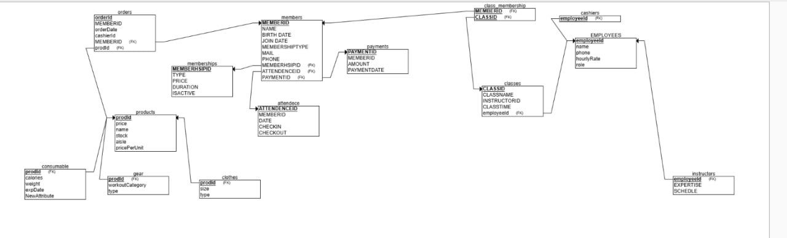
---

## 2. ERD Diagram – Received Department
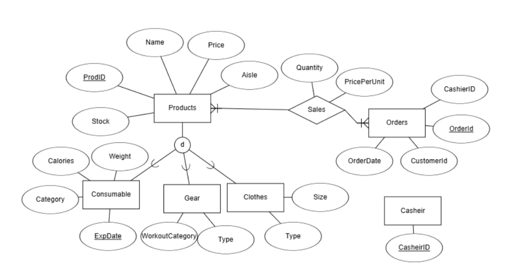
---
## 3. ERD Diagram – Unified Database (Post-Integration)
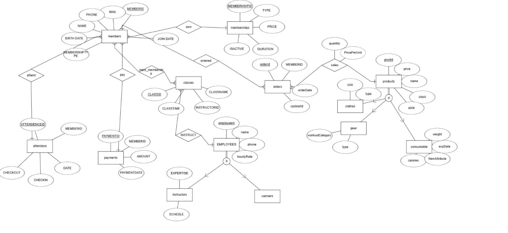
---
## 4. DSD Diagram – After Integration
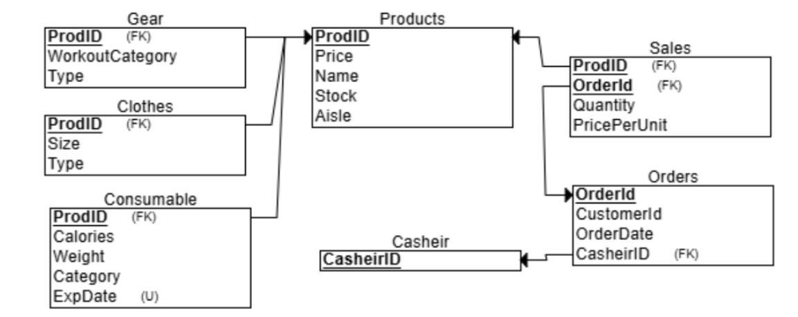
---
## 5. Integration Decisions and Explanations

### Integration Strategy:
- We received a system with two different employee-related tables: `instructors` and `cashiers`.
- To unify them, we created a new table: `employees`, containing the shared fields: `name`, `phone`, and `hourlyrate`.
- We added `employeeid` as a foreign key to both `instructors` and `cashiers`, and migrated the data accordingly.
- We dropped the duplicate fields from the original tables to avoid redundancy.
- We updated foreign keys in related tables (`classes` and `orders`) to reference `employees` instead of the old IDs.

### Key Decisions:
- We avoided creating a junction table and used foreign keys directly.
- Table names were unified (`cashiers` → `cashier`) for clarity and consistency.
- Referential integrity was preserved using `FOREIGN KEY` constraints.
---
## 6. Explanation of SQL Commands

**File:** `Integrate.sql`

- Create new `employees` table.
- Copy relevant data from `instructors` and `cashiers`.
- Set `employeeid` in both original tables.
- Remove redundant columns and add foreign key constraints.
- Update `classes` and `orders` to reference the unified `employeeid`.
- Rename `cashiers` table to `cashier`.

*Each command is explained with comments directly in the script.*
---
## 7. Views and Queries

### View 1 – `instructor_classes_view` (Instructor Classes View)

```sql
CREATE OR REPLACE VIEW instructor_classes_view AS
SELECT
    e.employeeid,
    e.name AS instructor_name,
    e.phone,
    e.hourlyrate,
    c.classid,
    c.classname,
    c.classtime
FROM employees e
JOIN instructors i ON e.employeeid = i.employeeid
JOIN classes c ON e.employeeid = c.employeeid;
```

**Explanation:**
This view shows instructors and the classes they teach, including class details and their hourly rate. It combines data from `employees`, `instructors`, and `classes` tables.

#### Query 1.1 – List all instructors and the number of classes they teach

```sql
SELECT
    instructor_name,
    COUNT(*) AS total_classes
FROM instructor_classes_view
GROUP BY instructor_name
ORDER BY total_classes DESC;
```

Returns all instructors ordered by the number of classes they teach, descending.
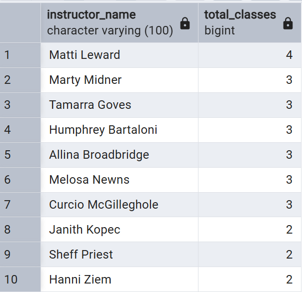

#### Query 1.2 – List all instructors and their estimated total income

```sql
SELECT
    instructor_name,
    hourlyrate,
    COUNT(*) AS total_classes,
    ROUND(COUNT(*) * hourlyrate, 2) AS estimated_total_income
FROM instructor_classes_view
GROUP BY instructor_name, hourlyrate
ORDER BY estimated_total_income DESC;
```

Shows instructors' total income based on their hourly rate and number of classes they teach.
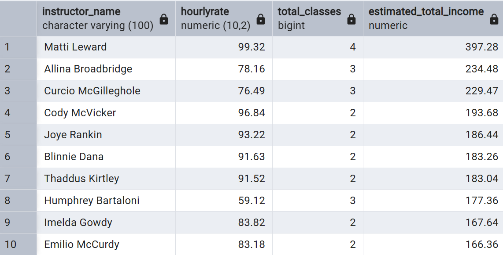
---
### View 2 – `cashier_orders_view` (Cashier Orders View)

```sql
CREATE VIEW cashier_orders_view AS
SELECT
    e.employeeid,
    e.name AS cashier_name,
    o.orderid,
    o.orderdate
FROM orders o
JOIN employees e ON o.cashierid = e.employeeid;
```

**Explanation:**
This view displays each cashier (employee) and the orders they handled. It joins the `orders` table with the `employees` table using the employee ID.

#### Query 2.1 – Number of orders handled per cashier

```sql
SELECT
    cashier_name,
    COUNT(orderid) AS total_orders
FROM cashier_orders_view
GROUP BY cashier_name
ORDER BY total_orders DESC;
```

Returns how many orders each cashier processed, ordered by total orders descending.
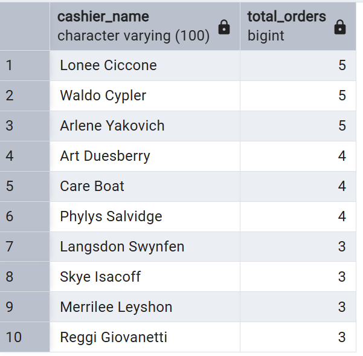

#### Query 2.2 – Count the number of orders handled by each cashier (Alternative approach)

```sql
SELECT 
    c.cashier_name,
    COUNT(o.orderid) AS total_orders_handled
FROM 
    cashier_orders_view c
JOIN 
    orders o ON c.employeeid = o.cashierid
GROUP BY 
    c.cashier_name;
```

Alternative method to count orders per cashier using a join with the orders table.
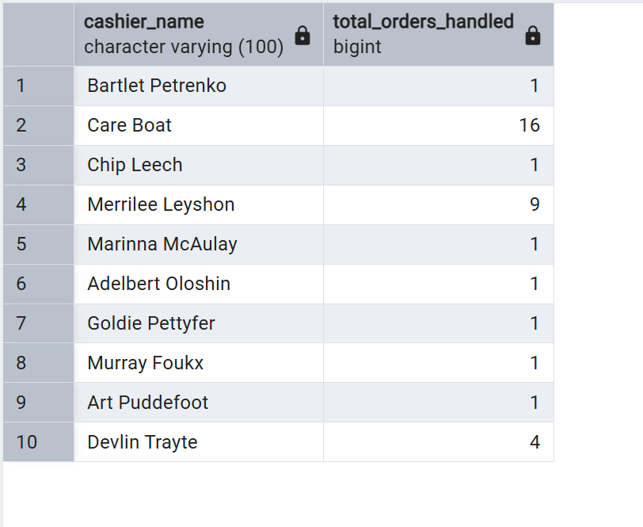

# Phase 4: Programming with PL/pgSQL

This phase focuses on writing PL/pgSQL functions, procedures, and triggers based on the integrated gym database. The goal is to demonstrate advanced server-side logic using the following features:

* Explicit and implicit cursors
* Returning refcursors
* DML operations
* Conditionals
* Loops
* Exception handling
* Records

We implemented:

* 2 Functions
* 2 Procedures
* 2 Triggers
* 2 Main test blocks (each invoking one function and one procedure)

---

## 1. Function: `calc_weekly_hours`

**Description:**
Calculates the total number of attendance hours for a given member within a specified 7-day window.

**Features used:**
Loop, conditionals, record, exception handling, date arithmetic.

```sql
CREATE OR REPLACE FUNCTION calc_weekly_hours(p_memberid INT, p_week_start DATE)
RETURNS NUMERIC AS $$
DECLARE
    total_hours NUMERIC := 0;
    rec RECORD;
BEGIN
    FOR rec IN
        SELECT checkin, checkout
        FROM attendance
        WHERE memberid = p_memberid
          AND date >= p_week_start
          AND date < p_week_start + INTERVAL '7 days'
    LOOP
        IF rec.checkout IS NOT NULL THEN
            total_hours := total_hours + EXTRACT(EPOCH FROM (rec.checkout - rec.checkin)) / 3600;
        END IF;
    END LOOP;

    RETURN total_hours;
END;
$$ LANGUAGE plpgsql;
```

---

## 2. Function: `get_cashier_orders`

**Description:**
Returns a refcursor with all orders handled by a specific cashier.

**Features used:**
Refcursor, dynamic query, returning from function.

```sql
CREATE OR REPLACE FUNCTION get_cashier_orders(p_cashierid INT)
RETURNS REFCURSOR AS $$
DECLARE
    cur_orders REFCURSOR;
BEGIN
    OPEN cur_orders FOR
        SELECT *
        FROM orders
        WHERE cashierid = p_cashierid;
    RETURN cur_orders;
END;
$$ LANGUAGE plpgsql;
```
---

## 3. Procedure: `add_attendance`

**Description:**
Adds an attendance record for a member, preventing duplicates on the same date. Raises an exception if a record already exists.

**Features used:**
Conditionals, exception, DML, record check.

```sql
CREATE OR REPLACE PROCEDURE add_attendance(
    p_memberid INT,
    p_date     DATE,
    p_checkin  TIME,
    p_checkout TIME
)
LANGUAGE plpgsql AS $$
DECLARE
    row_exists INT;
BEGIN
    SELECT COUNT(*)
    INTO row_exists
    FROM attendance
    WHERE memberid = p_memberid AND date = p_date;

    IF row_exists > 0 THEN
        RAISE EXCEPTION 'Attendance already recorded for member % on %', p_memberid, p_date;
    END IF;

    INSERT INTO attendance(attendanceid, memberid, date, checkin, checkout)
    VALUES (nextval('attendance_attendanceid_seq'), p_memberid, p_date, p_checkin, p_checkout);
END;
$$;
```

**Screenshot of failed attempt of inserting duplicate**

---

## 4. Procedure: `update_hourly_rate`

**Description:**
Updates the hourly rate for an employee. Validates that the new rate is positive.

**Features used:**
Conditionals, DML, exception handling, `NOT FOUND`.

```sql
CREATE OR REPLACE PROCEDURE update_hourly_rate(p_empid INT, p_new_rate NUMERIC)
LANGUAGE plpgsql AS $$
BEGIN
    IF p_new_rate <= 0 THEN
        RAISE EXCEPTION 'Hourly rate must be positive (got %)', p_new_rate;
    END IF;

    UPDATE employees
    SET hourlyrate = p_new_rate
    WHERE employeeid = p_empid;

    IF NOT FOUND THEN
        RAISE NOTICE 'No employee with id % found – nothing updated', p_empid;
    END IF;
END;
$$;
```

**Screenshot of exception when trying to change hourly rate to negative number**
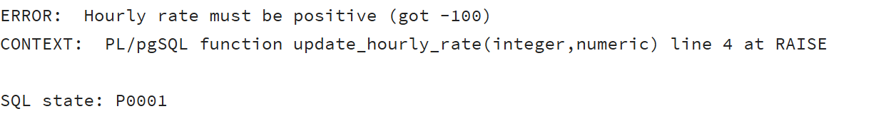
---

## 5. Trigger: `trg_default_checkout`

**Description:**
Sets the `checkout` value to one hour after `checkin` if it is missing, before insert.

```sql
CREATE OR REPLACE FUNCTION default_checkout()
RETURNS TRIGGER AS $$
BEGIN
    IF NEW.checkout IS NULL THEN
        NEW.checkout := NEW.checkin + INTERVAL '1 hour';
    END IF;
    RETURN NEW;
END;
$$;

CREATE TRIGGER trg_default_checkout
BEFORE INSERT ON attendance
FOR EACH ROW
EXECUTE FUNCTION default_checkout();
```

**Screenshot of insert without checkout and the result**
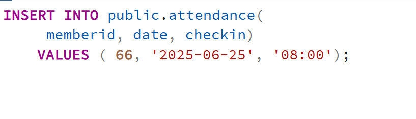
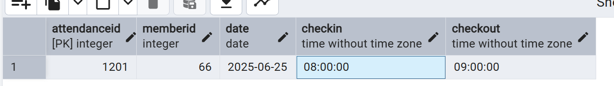
---

## 6. Trigger: `trg_validate_cashier`

**Description:**
Ensures that an order references an existing cashier. If the cashier ID does not exist, the trigger blocks the insert.

```sql
CREATE OR REPLACE FUNCTION validate_cashier()
RETURNS TRIGGER AS $$
BEGIN
    PERFORM 1 FROM employees WHERE employeeid = NEW.cashierid;

    IF NOT FOUND THEN
        RAISE EXCEPTION 'Cashier id % does not exist in employees', NEW.cashierid;
    END IF;

    RETURN NEW;
END;
$$;

CREATE TRIGGER trg_validate_cashier
BEFORE INSERT ON orders
FOR EACH ROW
EXECUTE FUNCTION validate_cashier();
```

**Screenshot of insert with bad cashier id**
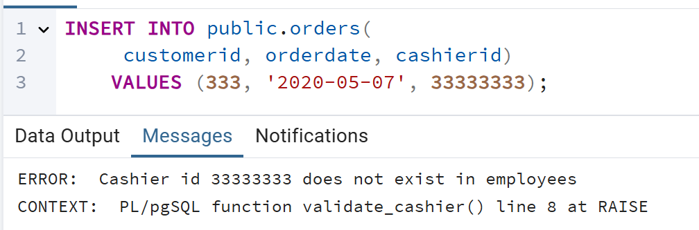

---

## 7. Main Block 1: Attendance Tracking

**Description:**
Demonstrates inserting an attendance record and calculating total hours worked.

```sql
DO $$
DECLARE
    v_total NUMERIC;
BEGIN
    BEGIN
        CALL add_attendance(1, CURRENT_DATE, '08:00', NULL);
    EXCEPTION
        WHEN OTHERS THEN
            RAISE NOTICE 'Skipping attendance insert: %', SQLERRM;
    END;

    v_total := calc_weekly_hours(1, (CURRENT_DATE - INTERVAL '7 days')::DATE);
    RAISE NOTICE 'Total hours for member 1 in past 7 days: %', v_total;
END;
$$;
```

**Screenshot of result:**
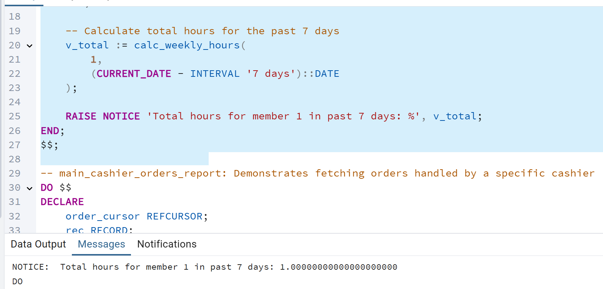
---

## 8. Main Block 2: Cashier Orders Report

**Description:**
Fetches orders handled by a specific cashier using a refcursor.

```sql
DO $$
DECLARE
    order_cursor REFCURSOR;
    rec RECORD;
BEGIN
    order_cursor := get_cashier_orders(455);

    LOOP
        FETCH order_cursor INTO rec;
        EXIT WHEN NOT FOUND;
        RAISE NOTICE 'Order: (%)', rec;
    END LOOP;

    CLOSE order_cursor;
END;
$$;
```

**Screenshot of result:**
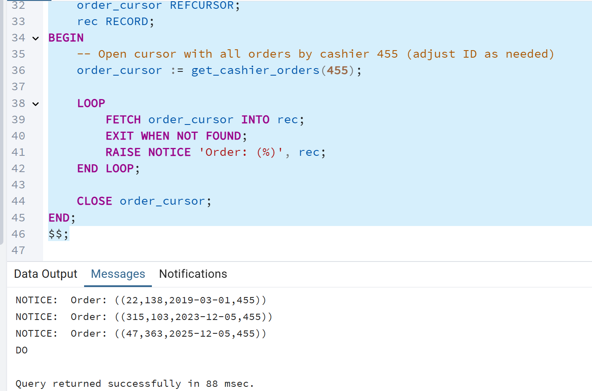
---

## Summary

All programs were tested and executed successfully. The output and behavior matched expectations, including proper use of triggers, exception handling, and cursors. Screenshots above demonstrate these behaviors.

---

# Phase 5: Web Application Interface

## Overview

Phase 5 introduces a comprehensive web application interface for the Gym Management System. This modern, responsive web application provides a complete frontend for managing all aspects of the gym database, including members, classes, employees, products, and advanced reporting capabilities.

## Features

### Core Functionality
- **Complete CRUD Operations**: Full Create, Read, Update, Delete functionality for class,classmembership,members entities
- **Real-time Database Integration**: Direct connection to PostgreSQL database via REST API
- **Advanced Reporting**: Execute custom SQL queries, stored procedures, and functions
- **Interactive Analytics**: Charts and visualizations for business insights
- **Dark Mode Support**: Toggle between light and dark themes with persistent preferences

### User Interface
- **Modern Design**: Clean, professional interface with smooth animations
- **Responsive Layout**: Optimized for desktop, tablet, and mobile devices
- **Intuitive Navigation**: Easy-to-use sidebar navigation with clear visual indicators
- **Search and Filtering**: Advanced search capabilities across all data tables
- **Modal Forms**: User-friendly forms for data entry and editing

### Database Integration
- **Live Data**: All CRUD operations pull data directly from the PostgreSQL database
- **Stored Procedures**: Execute the custom procedures developed in Phase 4
- **Database Functions**: Call and display results from custom PL/pgSQL functions
- **Custom Queries**: Run any SQL query and view results in formatted tables
- **Error Handling**: Comprehensive error handling with user-friendly messages

## Technology Stack

### Frontend
- **React 18**: Modern React with hooks and functional components
- **TypeScript**: Type-safe development with full IntelliSense support
- **Tailwind CSS**: Utility-first CSS framework for rapid UI development
- **Vite**: Fast build tool and development server
- **Recharts**: Beautiful, responsive charts for data visualization
- **Lucide React**: Modern icon library with consistent design

### Backend
- **Node.js**: JavaScript runtime for server-side development
- **Express.js**: Web application framework for REST API
- **PostgreSQL**: Robust relational database management system
- **pg**: PostgreSQL client for Node.js with connection pooling
- **CORS**: Cross-origin resource sharing for secure API access

### Development Tools
- **ESLint**: Code linting for consistent code quality
- **PostCSS**: CSS processing with Autoprefixer
- **Hot Module Replacement**: Instant updates during development

## Application Instructions

### Prerequisites
- Node.js (v14 or higher)
- PostgreSQL database
- npm (Node Package Manager)

### Installation Steps

1. Clone the repository:
```bash
git clone https://github.com/Azriel-Ehrlich/DBProject_2539_0825.git
cd DBProject_2539_0825
```

2. Install backend dependencies:
```bash
cd phase5/backend
npm install
```

3. Install frontend dependencies:
```bash
cd ../frontend
npm install
```

4. Configure the database:
- Make sure PostgreSQL is running
- Create a database named 'gym_management'
- Run the SQL scripts from phase1/scripts/createTables.sql
- Run the SQL scripts from phase1/scripts/insertTables.sql

5. Configure environment variables:
- Create a .env file in the backend directory with the necessary database configuration

### Running the Application

1. Start the backend server:
```bash
cd phase5/backend
npm start
```

2. Start the frontend development server:
```bash
cd phase5/frontend
npm start
```

3. Access the application:
- Open your browser and navigate to `http://localhost:3000`

## Application Screenshots

### Login Page
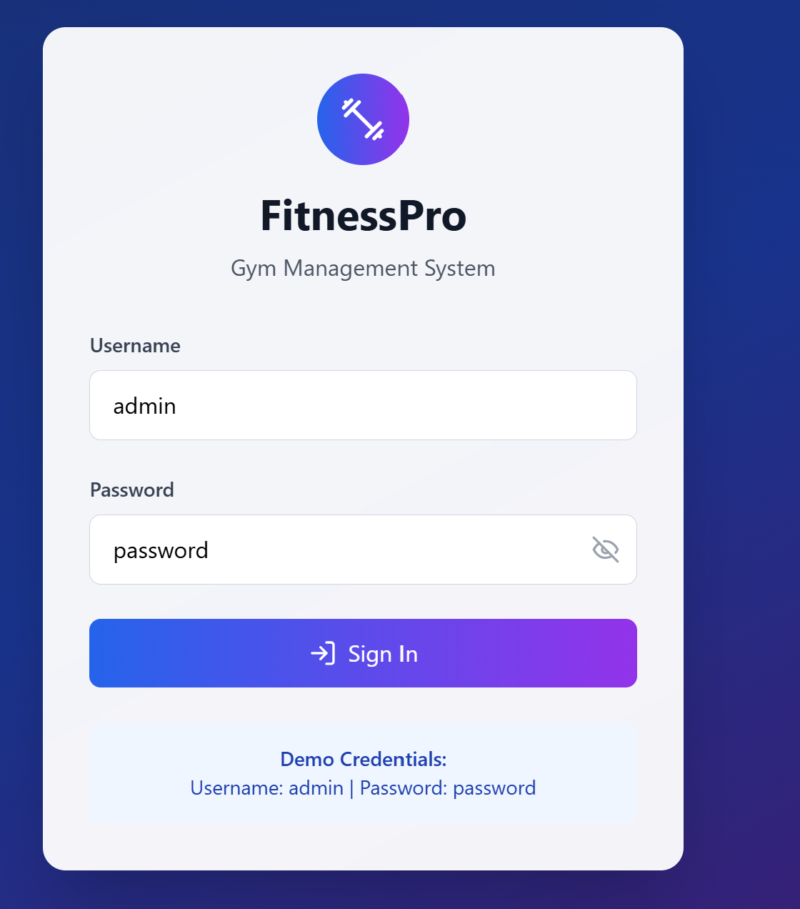

### Dashboard
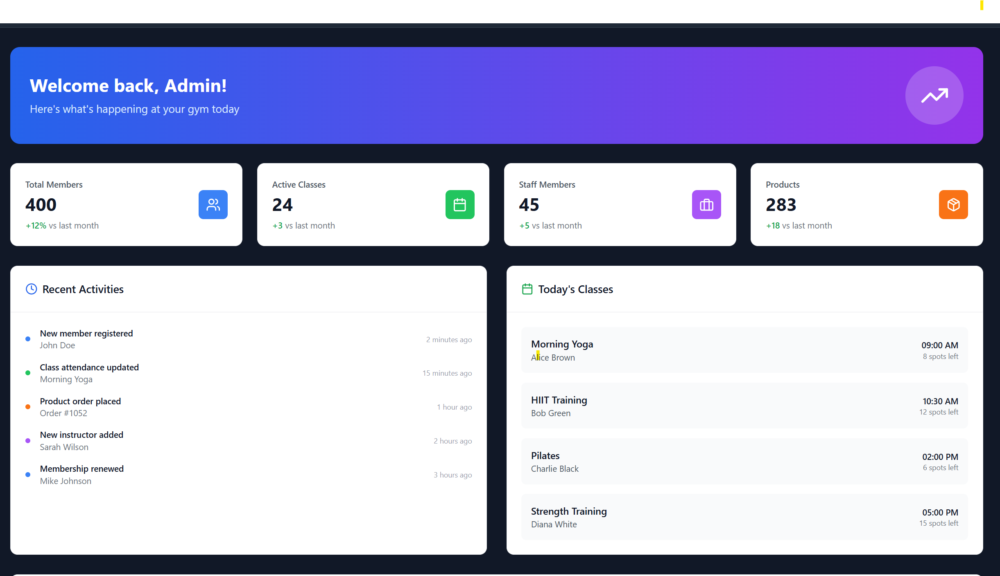

### Members Management
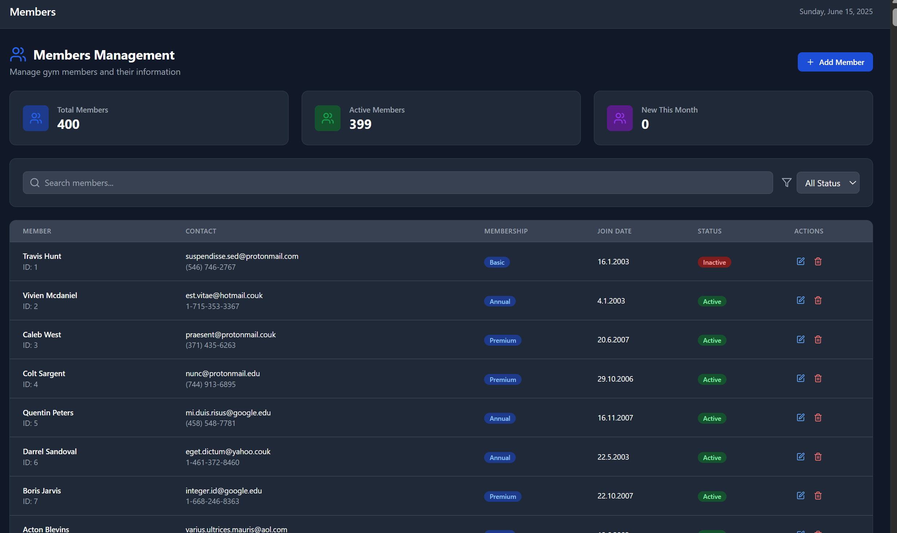

### Classes Management
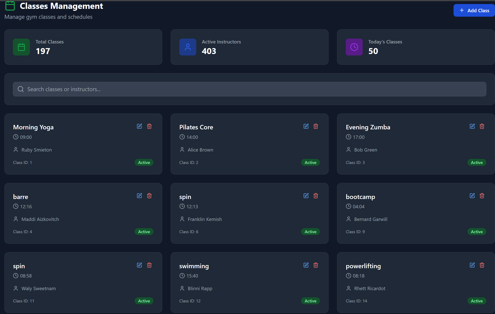

### Class Membership
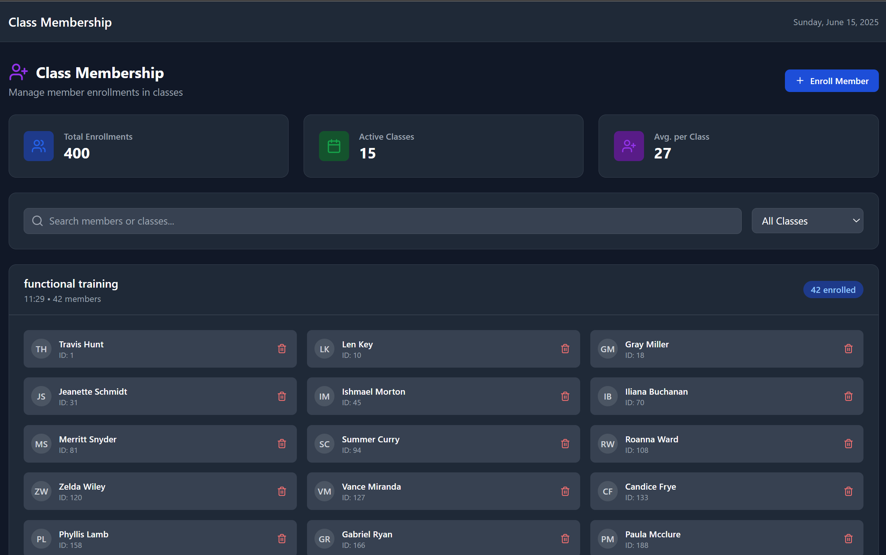

### Reports
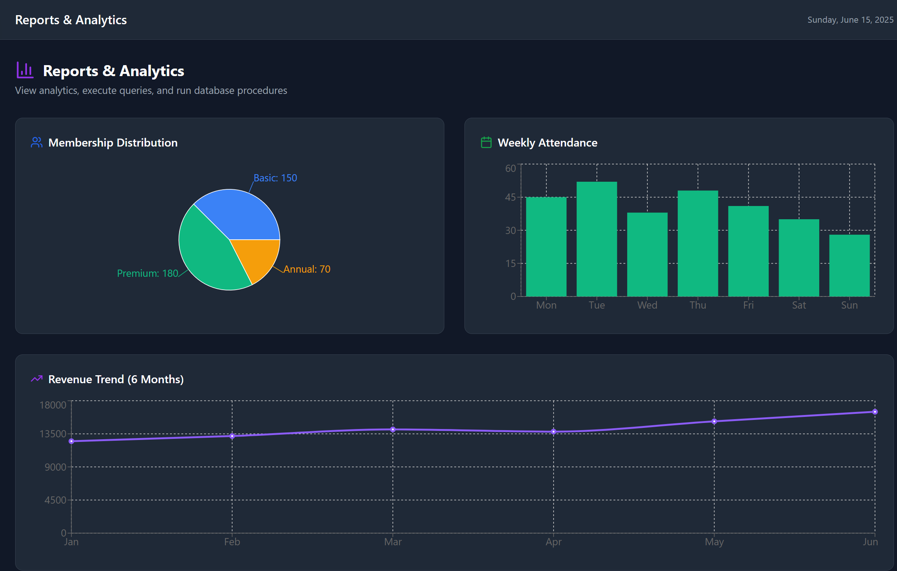

### Database Operations Examples

#### Function Execution
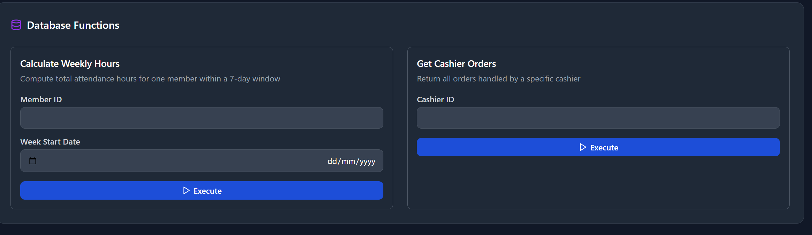 -*the functions we support*
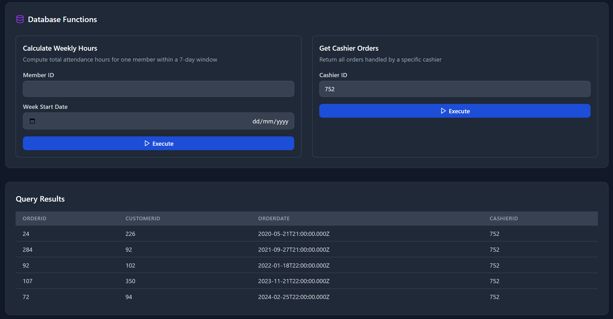 -*the result of the function get_cashier_orders*
#### Procedure Execution
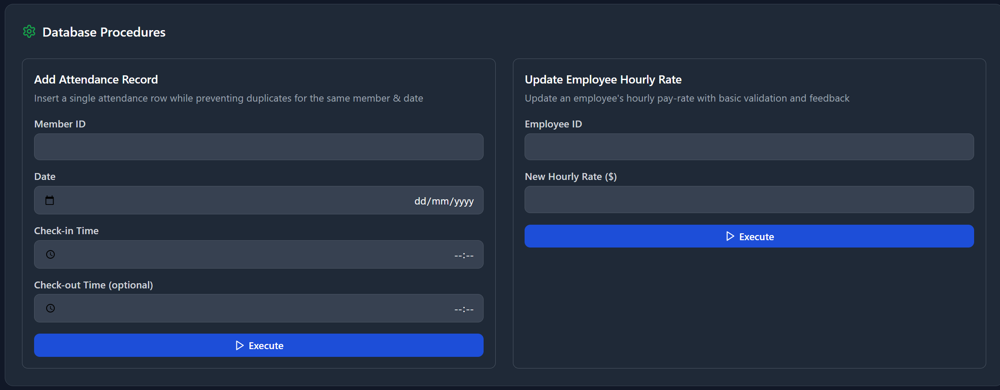 -*the procedures we support*
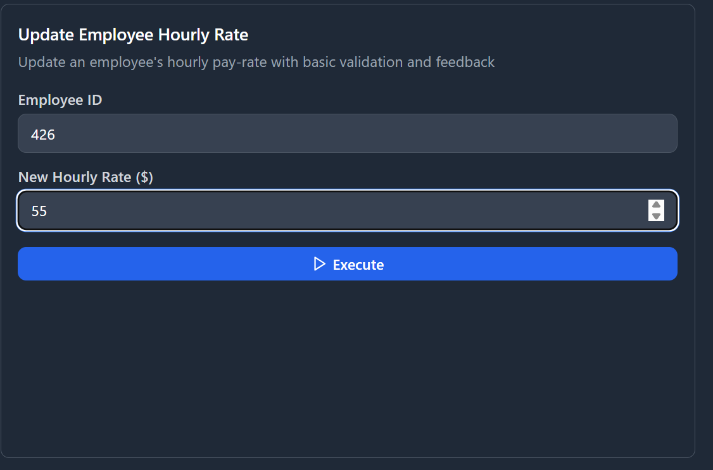 -*the  procedure update_hourly_rate that we'll execute*
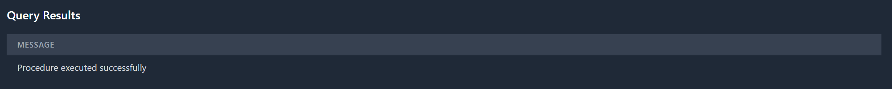 -*the result of the procedure update_hourly_rate*

#### Complex Query
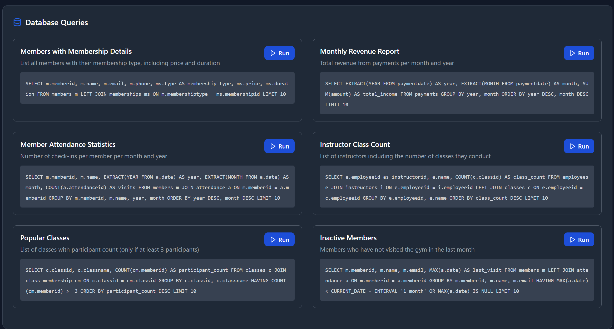 -*the queries we support*
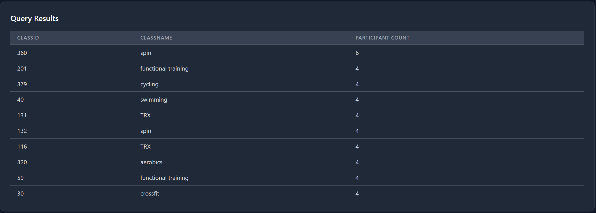 -*the result of the query that shows the most popular class in the gym*