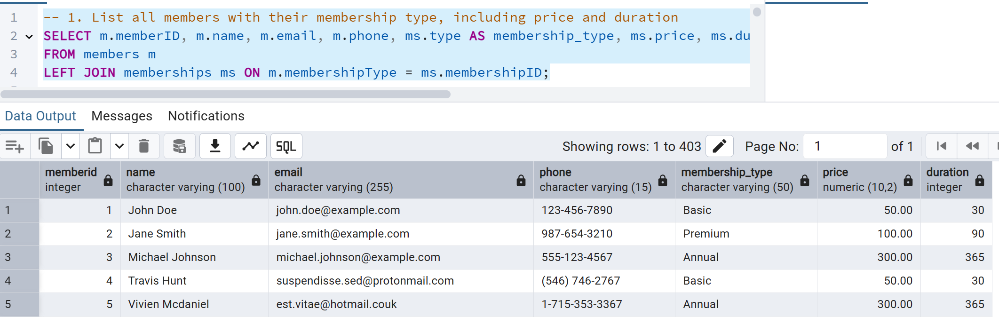
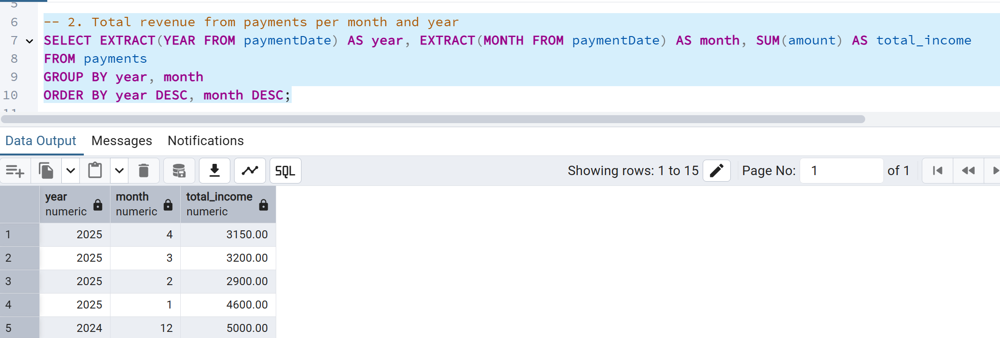

# Gym Management System

#### Azriel Ehrlich  
#### Itamar Haimov


## Table of Contents  
- [Phase 1: Design and Build the Database](#phase-1-design-and-build-the-database)  
  - [Introduction](#introduction)  
  - [ERD (Entity-Relationship Diagram)](#erd-entity-relationship-diagram)  
  - [DSD (Data Structure Diagram)](#dsd-data-structure-diagram)  
  - [SQL Scripts](#sql-scripts)  
  - [Data](#data)
  - [Backup](#backup)  
- [Phase 2: Advanced SQL and Data Manipulation](#phase-2-advanced-sql-and-data-manipulation)  
  - [Complex SQL Queries](#complex-sql-queries)  
  - [DELETE Operations](#delete-operations)  
  - [UPDATE Operations](#update-operations)  
  - [Constraints using ALTER TABLE](#constraints-using-alter-table)  
  - [Transaction Management - COMMIT and ROLLBACK](#transaction-management---commit-and-rollback)  

## Phase 1: Design and Build the Database  

### Introduction

### Gym Management Database

The **Gym Management Database** is designed to efficiently manage information related to gym members, staff, and memberships. This system ensures smooth organization and tracking of essential details such as membership plans, staff assignments, member contact information, and fitness progress.

#### Purpose of the Database
This database serves as a structured and reliable solution for gyms to:  
- **Organize memberships** by type (e.g., monthly, annual) and status (active, expired).  
- **Manage staff assignments** by linking trainers and other staff to specific tasks or clients.  
- **Maintain member details**, including contact information, membership history, and fitness goals.  
- **Store contact information**, including addresses, phone numbers, and emails for members and staff.  
- **Track fitness progress**, such as training routines, goals, and attendance records.

#### Potential Use Cases
- **Gym Administrators** can use this database to efficiently manage membership plans, assign staff to clients, and store emergency contacts.  
- **Members** can track their membership status, view assigned trainers, and update personal fitness goals.  
- **Trainers and Staff** can view their assigned clients, schedule sessions, and monitor client progress.  
- **Management** can use the system for record-keeping, scheduling, and communication with both staff and members.  

This structured database helps streamline gym operations, improving organization, member satisfaction, and communication among all parties involved.

###  ERD (Entity-Relationship Diagram)    
  

###  DSD (Data Structure Diagram)   
  

###  SQL Scripts  
Provide the following SQL scripts:  
- **Create Tables Script** - The SQL script for creating the database tables is available in the repository:  

📜 **[View `create_tables.sql`](phase1/scripts/createTables.sql)**  

- **Insert Data Script** - The SQL script for insert data to the database tables is available in the repository:  

📜 **[View `insert_tables.sql`](phase1/scripts/insertTables.sql)**  
 
- **Drop Tables Script** - The SQL script for droping all tables is available in the repository:  

📜 **[View `drop_tables.sql`](phase1/scripts/dropTables.sql)**  

- **Select All Data Script**  - The SQL script for selectAll tables is available in the repository:  

📜 **[View `selectAll_tables.sql`](phase1/scripts/selectAll.sql)**  
  
###  Data  
####  First tool: using [mockaro](https://www.mockaroo.com/) to create csv file
#####  Entering data about members and classes they take
-  person id scope 1-400
- class id scope 1-750
  📜[View `class_membershipMock_data.csv`](Phase1/mockData/nannyMOCK_DATA.csv)
#####  Entering a data to instructors
-  instructor id scope 1-400


📜[View `instructorMock_data.csv`](phase1/mockarooFiles/instractors_data.csv)


####  Second tool: using [generatedata](https://generatedata.com/generator). to create csv file 
#####  Entering data about members of the gym
-  Group Number  scope 1-400 
📜[View `member_dataGenerateData.csv`](phase1/generatedataFiles/member_data.csv)


####  Third tool: using python to insert data to the database
#####  Creating and Entering data about classes in the gym
📜[View `classes.csv`](phase1/programming/classes.csv)

📜[View `generate_classes.py`](phase1/programming/generate_classes.py)

📜[View `insert_classes.py`](phase1/programming/insert_classes.py)

##### creating and entering data about payments
📜[View `payments.csv`](phase1/programming/payments.csv)

📜[View `generate_payments.py`](phase1/programming/generate_payments.py)

📜[View `insert_payments.py`](phase1/programming/insert_payments.py)


### Backup 
-   backups files are kept with the date and hour of the backup:  

[backup_directory](backups)


# Phase 2: Advanced SQL and Data Manipulation

This phase focuses on advanced SQL operations, including complex queries, data updates, deletions, constraints, and transaction control using ROLLBACK and COMMIT. These elements enhance the reliability, consistency, and functionality of our Gym Management System.

---

## Complex SQL Queries

Each query below includes:

* A description in English
* A screenshot of the query execution in SSMS
* A screenshot showing the result (only 5 rows maximum per screenshot)

### Query 1: List all Members with Their Membership Type

* **Description:** List all members with their membership type, including price and duration.

```sql
SELECT m.memberID, m.name, m.email, m.phone, ms.type AS membership_type, ms.price, ms.duration
FROM members m
LEFT JOIN memberships ms ON m.membershipType = ms.membershipID;
```

📸  – *Query execution*
📸  – *Result preview*

### Query 2: Total Revenue from Payments Per Month and Year

* **Description:** Displays the total revenue generated each month.

```sql
SELECT EXTRACT(YEAR FROM paymentDate) AS year, EXTRACT(MONTH FROM paymentDate) AS month, SUM(amount) AS total_income
FROM payments
GROUP BY year, month
ORDER BY year DESC, month DESC;
```

📸  – *Query execution*
📸  – *Result preview*

### Query 3: Number of Check-ins per Member per Month and Year

* **Description:** Count of check-ins per member per month.

```sql
SELECT m.memberID, m.name, EXTRACT(YEAR FROM a.date) AS year, EXTRACT(MONTH FROM a.date) AS month, COUNT(a.attendanceID) AS visits
FROM members m
JOIN attendance a ON m.memberID = a.memberID
GROUP BY m.memberID, m.name, year, month
ORDER BY year DESC, month DESC;
```

📸  – *Query execution*
📸  – *Result preview*

### Query 4: List of Instructors Including Number of Classes

* **Description:** Shows instructors and how many classes each conducts.

```sql
SELECT i.instructorID, i.name, COUNT(c.classID) AS class_count
FROM instructors i
LEFT JOIN classes c ON i.instructorID = c.instructorID
GROUP BY i.instructorID, i.name
ORDER BY class_count DESC;
```

📸  – *Query execution*
📸  – *Result preview*

### Query 5: List of Classes with at Least 3 Participants

* **Description:** Shows all classes with 3 or more participants.

```sql
SELECT c.classID, c.className, COUNT(cm.memberID) AS participant_count
FROM classes c
JOIN class_membership cm ON c.classID = cm.classID
GROUP BY c.classID, c.className
HAVING COUNT(cm.memberID) >= 3
ORDER BY participant_count DESC;
```

📸  – *Query execution*

### Query 6: Members Who Haven't Visited in the Last Month

* **Description:** Members whose last visit was over a month ago or never visited.

```sql
SELECT m.memberID, m.name, m.email, MAX(a.date) AS last_visit
FROM members m
LEFT JOIN attendance a ON m.memberID = a.memberID
GROUP BY m.memberID, m.name, m.email
HAVING MAX(a.date) < CURRENT_DATE - INTERVAL '1 month' OR MAX(a.date) IS NULL;
```

📸  – *Query execution*

### Query 7: Members with More Than One Payment in the Same Month

* **Description:** Detects duplicate payments within a month.

```sql
SELECT m.memberID, m.name, EXTRACT(YEAR FROM p.paymentDate) AS year, EXTRACT(MONTH FROM p.paymentDate) AS month, COUNT(p.paymentID) AS payment_count
FROM payments p
JOIN members m ON p.memberID = m.memberID
GROUP BY m.memberID, m.name, year, month
HAVING COUNT(p.paymentID) > 1;
```

📸  – *Query execution*

### Query 8: Payments with Member and Membership Info

* **Description:** Displays payment history with member and membership data.

```sql
SELECT p.paymentID, m.name, ms.type AS membership_type, p.amount, p.paymentDate
FROM payments p
JOIN members m ON p.memberID = m.memberID
LEFT JOIN memberships ms ON m.membershipType = ms.membershipID
ORDER BY p.paymentDate DESC;
```

📸  – *Result preview*

---

## DELETE Operations

### Delete 1: Members with No Visits in the Last 3 Years

```sql
DELETE FROM members
WHERE memberID IN (
    SELECT m.memberID FROM members m
    LEFT JOIN attendance a ON m.memberID = a.memberID
    GROUP BY m.memberID
    HAVING MAX(a.date) < CURRENT_DATE - INTERVAL '1 year'*3 OR MAX(a.date) IS NULL
);
```

📸  – *Before the  Delete execution*
📸  – *The  Delete execution*
📸  – *After the Delete execution*

### Delete 2: Payments Older than 5 Years

```sql
DELETE FROM payments
WHERE paymentDate < CURRENT_DATE - INTERVAL '5 years';
```

📸  – *Before the Delete execution*
📸  – *The Delete execution*
📸  – *After the Delete execution*

### Delete 3: Classes with No Registered Participants

```sql
DELETE FROM classes
WHERE classID NOT IN (SELECT DISTINCT classID FROM class_membership);
```

📸  – *Before the Delete execution*
📸  – *The Delete execution*
📸  – *After the Delete execution*

---

## UPDATE Operations

### Update 1: Increase Membership Prices by 10%

```sql
UPDATE memberships
SET price = price * 1.10;
```

📸  – *Update execution*

### Update 2: Mark Expired Memberships as Inactive

```sql
UPDATE members
SET status = 'InActive'
WHERE memberID IN (
    SELECT m.memberID FROM members m
    JOIN memberships ms ON m.membershipType = ms.membershipID
    WHERE CURRENT_DATE > (m.join_date + ms.duration/365)
);
```

📸  – *Update execution*

### Update 3: Format Phone Numbers with Country Code

```sql
UPDATE members
SET phone = CONCAT('+972', phone)
WHERE phone NOT LIKE '+972%';
```

📸  – *Update execution*

---

## Constraints using ALTER TABLE

### Constraint 1: Unique Email on Members

```sql
ALTER TABLE members
ADD CONSTRAINT unique_email UNIQUE (email);
```

📸  – *Constraint added*

### Constraint 2: Positive Price on Memberships

```sql
ALTER TABLE memberships
ADD CONSTRAINT check_price_positive CHECK (price > 0);
```

📸  – *Constraint added*

---

### Constraint 3: members are 18 years old or older

```sql
-- 3. Ensure that all the members are 18+ yo
ALTER TABLE members
ADD CONSTRAINT check_member_age 
CHECK (birth_date <= CURRENT_DATE - INTERVAL '18 years');
```
📸  – *Constraint added*

## Transaction Management - COMMIT and ROLLBACK

### COMMIT Example

```sql
-- Start another transaction
BEGIN;

-- Update the same member again
UPDATE members
SET status = 'Inactive'
WHERE memberID = 1;

-- Show the updated result (for screenshot)
SELECT memberID, name, status
FROM members
WHERE memberID = 1;

-- Commit the transaction
COMMIT;

-- Verify that the change was saved (for screenshot)
SELECT memberID, name, status
FROM members
WHERE memberID = 1;
```

📸  – *Before the COMMIT transaction*
📸  – *After the COMMIT transaction*

### ROLLBACK Example

```sql
-- Start a transaction
BEGIN;

-- Update a member's status to 'Inactive'
-- You can change the ID according to your data
UPDATE members
SET status = 'Inactive'
WHERE memberID = 1;

-- Show the result after the update (for screenshot)
SELECT memberID, name, status
FROM members
WHERE memberID = 1;

-- Rollback the transaction
ROLLBACK;

-- Verify that the original state was restored (for screenshot)
SELECT memberID, name, status
FROM members
WHERE memberID = 1;

```

📸  – *Before the ROLLBACK transaction and after the cange*
📸  – *After the ROLLBACK transaction*

---

